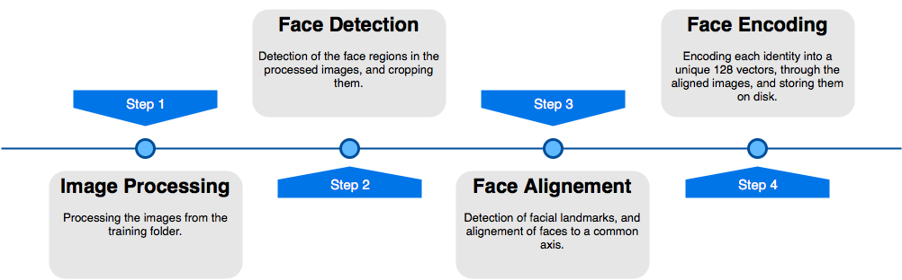
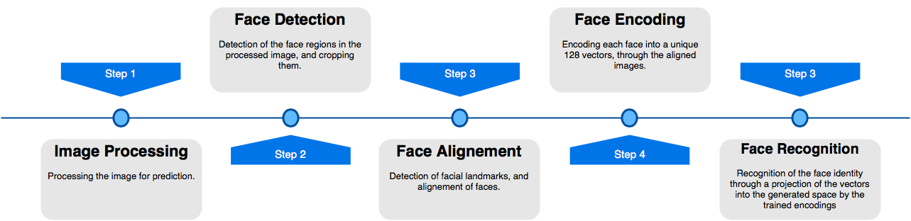

# Face-recognition library

Python library for face detection and face recognition tasks, following the method described in [this research paper](https://arxiv.org/abs/1503.03832).

*Current library version : 0.1*

### Environnement setup

***Recommended*** : On a Ubuntu 16.04 terminal, while in the whole repository's directory root, launch `sudo bash setup.sh`, installation of all necessary tools would be underway after you enter your root password.

If you want to install them manually, you would need the following dependencies :

- Python 3.x
- numpy
- dlib
- OpenCV-Python
- pandas
- tensorflow 1.x
- imutils


### Library Usage Guide

`train_model(folder, method ="hog")` :

This function enables to train/retrain the face recognition model on new identities. It has as arguments :

- folder : the path to the root folder that contains all the training images.

  ***Important :*** All images of the same identity should be added under the same folder, with that folder named with the name of the category/identity. For the valid category name notation, See [Note on name constraints](#name_constraints).

- method : the face detection method. The available methods are :

  - hog : the default detection method for face detection, available for both CPU and GPU, based on the Histogram of Gradients method.

  - haar : available for both CPU and GPU, based on the Haar cascades method

  - cnn : available only for GPU, based on neural networks

```python

import zihub.lib.train as train
train.train_model(pathToFolder)

```

`recognize_face(imagePath,method="hog",db="lib/encodings/encodings.pickle")` :

This function enables to recognize the identities of all the faces in an image, with the detection model trained with the `train_model` function. It takes as arguments :

- imagePath : the path of the image on the disk

- method : the face detection method. The available methods are :

  - hog : the default detection method for face detection, available for both CPU and GPU, based on the Histogram of Gradients method.

  - haar : available for both CPU and GPU, based on the Haar cascades method

  - cnn : available only for GPU, based on neural networks

***Recommended :*** It is recommended to use the same face detection method used to train the model with the `train_model` function, in order to achieve optimal precision results.

- db : Path to the encodings of the identities unto which the model was trained. It is by default the path of the encodings of the latest trained model.


```python

import zihub.lib.predict as predict
response = predict.recognize_face(imagePath)

```

##### Output


```json

[{
  "category" : "bendidi_ihab",
  "precision" : 0.9,
  "box" : [576, 1093, 1242, 428]
}]

```

- category : Identity of the recognized face. Unrecognized faces are marked as `"Unknown"`

- precision : Probability of the prediction

- box : coordinates of the face box in the image, in the format `(right,bottom,left,top)`

***Important :*** The output of the `recognize_face` function is a list containing the JSON. In the case of multiple faces in the image, the list contains multiple JSON, respectively for each face.


### Training Flow :

Once the `train_model` function is called, the data goes through the following pipeline :



### Prediction Flow :

Once the `recognize_face` function is called, the data goes through the following pipeline :




<a name="name_constraints"></a>
# Name constraints

Category names should only contain lower case characters `[a-z]`, dashes (`-`) and underscores (`_`).
Whitespace characters, accented characters and punctuation signs (except for dash) are not allowed.

Note that a category name shouldn’t be an empty string, shouldn’t contain two or more underscore characters or dashes in a row, and cannot start or end with an underscore character or a dash.

For people names, we recommend using `lastname_firstname_middlename` format, though it is not a constraint.
